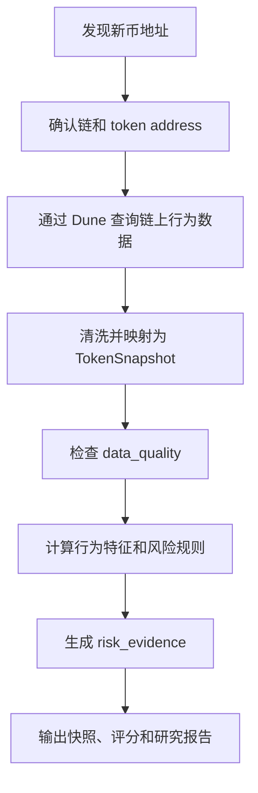

# ChainMind 代币分析流程：像数据分析师一样处理链上数据

日期：2026-05-27

## 1. 当前阶段判断

ChainMind Phase 2 可以认为已经完成了第一个可用闭环。

我们已经做到：

1. 有真实 BNB Chain meme 新币地址作为输入。
2. 可以通过 Dune API 自动执行查询。
3. 可以把 Dune 查询结果映射成 ChainMind 的 `TokenSnapshot`。
4. 可以基于结构化字段计算风险分数。
5. 可以输出 `risk_evidence`，也就是可解释的风险证据。
6. 可以保存真实 token 快照，供后续复盘和规则校准。
7. 已经产出 3 个真实 meme token 的研究报告。

这说明项目已经从“写规则和模拟样本”进入了“真实链上数据分析”阶段。

但 Phase 2 完成不等于产品已经完成。它代表我们已经有了最小可用的数据分析管线。接下来应该做的是扩大样本、补充数据源、校准规则、再接 AI 报告生成。

## 2. 我们分析一个币的完整流程

当前 ChainMind 分析一个 BNB meme 新币，大致分为 8 步。



### Step 1：发现新币地址

输入是一个 BNB Chain 上的新 token 合约地址。

来源可以是：

- DEX 新池子；
- Telegram/社区监控；
- PancakeSwap 新交易对；
- Dexscreener Trending；
- 用户手动输入；
- 后续 Hermes 自动推送。

当前我们是手动输入 3 个真实 BNB meme 新币地址。

未来更理想的方式是让系统自动发现新币，然后进入分析队列。

### Step 2：确认 token 的基础上下文

最基本需要确认：

| 字段 | 说明 |
| --- | --- |
| `chain` | 当前项目重点是 `bnb` |
| `token_address` | token 合约地址 |
| `first_trade_time` | 首次出现交易的时间 |
| `symbol` | 当前 Dune-only 阶段可能为空或 UNKNOWN |
| `pair/router` | 主要交易发生在哪个 DEX |

这一步的核心不是评分，而是确认“我们分析的是哪个资产，以及它是否真的有链上交易”。

### Step 3：拉取 Dune 链上行为数据

Phase 2 当前使用 4 类 Dune 查询：

| 查询 | 作用 | 用来回答的问题 |
| --- | --- | --- |
| `token_trading_activity.sql` | 交易活跃度 | 这个币有没有真实交易？交易量和交易人数如何？ |
| `five_minute_flow.sql` | 5 分钟买卖盘 | 最近买盘强还是卖盘强？是否正在出货？ |
| `early_buyers.sql` | 早期买家行为 | 早期买家是否已经退出？是否仍持有？ |
| `early_buyer_funding.sql` | 早期买家资金来源 | 早期买家是否由同一批资金资助？ |

Dune 查询的本质是把链上原始交易数据转成分析表。

这里要注意：

- Dune 查询的是公共链上表，不是某个 token 自己的字段；
- 不同 token 会导致返回的 rows 数量不同，但字段结构应该相同；
- 如果字段错了，会报 SQL column error；
- 如果是 `SSL/TLS` 错误，一般是 API 网络连接问题，不是 token 字段不同。

### Step 4：把查询结果映射成统一快照

Dune 返回的是 rows。

ChainMind 不直接拿 rows 去评分，而是先映射成统一结构：

```text
TokenSnapshot
├── token
├── market
├── flow_5m
├── early_buyers
├── funding
├── security
└── data_quality
```

这样做的意义是：

1. 后续可以替换数据源，不一定永远只用 Dune。
2. 评分逻辑不用关心 SQL 字段名，只关心业务字段。
3. AI 解释也可以基于统一的 `risk_evidence`，而不是直接读原始 SQL。
4. 真实样本、模拟样本、API 数据都可以进入同一个评分流程。

### Step 5：检查数据质量

`data_quality` 不是流动性本身，它是判断“这次分析是否可靠”的机制。

它会关心：

| 检查项 | 含义 |
| --- | --- |
| 是否有市场交易数据 | 没有交易数据就不能判断交易行为 |
| 是否有 5 分钟买卖盘 | 没有短周期 flow 就不能判断当前买卖压力 |
| 是否有早期买家 | 没有 early buyers 就不能判断早期筹码行为 |
| 是否有 funding 数据 | 没有资金来源就不能判断同源集群 |
| 是否缺安全 API | 没接 honeypot/税率/LP 时，需要标注局限 |

数据质量决定的是“评分可信度”，不是直接决定一个币好坏。

举例：

- 一个币风险分很高，数据质量 good，说明风险证据比较扎实。
- 一个币风险分很低，但数据质量 poor，不能说明它安全，只能说明数据不足。

### Step 6：构建分析特征

数据分析师不会直接看原始 rows，而是会把数据变成可以判断的指标。

当前 Phase 2 已经构建的指标包括：

| 特征类别 | 指标 | 用途 |
| --- | --- | --- |
| 市场活跃度 | volume、trades、unique traders | 判断是否有真实交易活动 |
| 交易密度 | trades / unique traders | 判断是否可能存在刷量或机器人交易 |
| 短周期买卖盘 | latest net buy、buyers、sellers | 判断是否短期卖压增强 |
| 连续卖压 | 最近几个 5 分钟桶净买入是否为负 | 判断是否持续流出 |
| 早期买家退出 | early buyer exit ratio | 判断早期筹码是否兑现 |
| 剩余持仓 | remaining ratio | 判断早期地址是否还持币 |
| 资金来源集群 | shared funder cluster | 判断多个早期买家是否同源 |
| 新钱包比例 | new wallet ratio | 判断是否大量新钱包参与 |

这些指标就是 ChainMind 的核心资产。

AI 可以解释结果，但真正让项目有价值的是这些链上行为特征。

### Step 7：规则评分和风险证据

当前 ChainMind 不是让 AI 直接随便判断风险，而是先用规则生成结构化证据。

例子：

```json
{
  "rule_id": "early_buyer_exit_ratio_high",
  "metric": "early_buyer_exit_ratio",
  "value": 0.94,
  "severity": "high"
}
```

这样设计的好处：

1. 规则可测试。
2. 结果可复盘。
3. AI 不会凭空编造风险。
4. 后续可以用真实样本校准阈值。
5. 用户可以看到“为什么这个币被过滤”。

当前已有的主要风险规则：

| 规则 | 解释 |
| --- | --- |
| `low_liquidity` | 流动性太低 |
| `high_trade_density` | 单个交易者平均交易次数过高 |
| `negative_latest_net_buy` | 最新 5 分钟净买入为负 |
| `sell_pressure_dominates` | 卖方人数和卖出金额同时占优 |
| `repeated_negative_net_buy` | 最近多个 5 分钟桶持续净卖出 |
| `early_buyer_exit_ratio_high` | 早期买家大量退出 |
| `shared_funder_cluster` | 多个早期买家来自同一资金来源 |
| `new_wallet_ratio_high` | 大量新钱包参与 |
| `security_high_risk` | 安全 API 标记高风险 |

### Step 8：输出快照、评分和报告

当前输出分三层：

| 输出 | 作用 |
| --- | --- |
| JSON 快照 | 保存原始结构化分析数据 |
| 评分结果 | 给出 grade、action、risk_score |
| Markdown 研究报告 | 给人阅读和复盘 |

当前真实快照位置：

```text
experiments/week2-token-risk-score/real-token-snapshots/
```

当前真实研究报告位置：

```text
docs/research/2026-05-26-bnb-meme-token-real-research-report.md
```

## 3. 像数据分析师一样处理链上数据

我们后续不能只把项目理解成“写几个 SQL”或“让 AI 判断币好坏”。

更准确的思路是：像数据分析师一样做链上数据研究。

### 3.1 明确分析问题

每一次分析前先问：

1. 这个币是否有真实交易活动？
2. 当前买盘强还是卖盘强？
3. 早期买家是否已经大量退出？
4. 早期买家是否由同一批资金控制？
5. 有没有安全层面的硬风险？
6. 这个币应该进入关注列表，还是只存档，还是直接过滤？

不要一开始就问“它会不会涨”。  
ChainMind 当前要解决的是“风险过滤和投研辅助”，不是价格预测。

### 3.2 把链上事件变成指标

链上原始数据通常是这样的：

- 一笔交易；
- 一个钱包；
- 一个时间戳；
- 一个 token transfer；
- 一个 swap；
- 一个 funding transaction。

数据分析师要做的是把它们聚合成指标：

| 原始事件 | 分析指标 |
| --- | --- |
| swap 交易 | 交易量、买卖方向、买卖人数 |
| transfer 记录 | 当前余额、是否退出 |
| funding 交易 | 首个资金来源、共同 funder |
| block_time | 首次交易、钱包年龄、时间窗口 |
| tx_from / tx_to | 钱包关系、资金路径 |

也就是说，链上分析的关键不是“看到很多交易”，而是“把交易变成可以判断的行为特征”。

### 3.3 先做事实，再做判断

一个好的分析流程应该分层：

1. 事实层：Dune/API 返回的真实数据。
2. 指标层：交易量、买卖盘、退出比例、同源资金。
3. 证据层：哪些规则被触发。
4. 判断层：grade、action、risk_score。
5. 解释层：AI 或报告用人话说明原因。

不能把这几层混在一起。

尤其不能让 AI 直接替代事实层和指标层。  
AI 适合解释和总结，不适合凭空生成链上事实。

### 3.4 保留可复盘数据

每一次真实分析都应该保存：

| 文件 | 作用 |
| --- | --- |
| 原始 Dune rows cache | 失败恢复和调试 |
| TokenSnapshot JSON | 后续规则校准 |
| 分析结果 | 复盘评分 |
| Markdown 报告 | 人类阅读 |

当前项目已经支持：

- Dune rows 缓存；
- Dune `execution_id` 恢复；
- 真实 token snapshot 保存；
- 研究报告沉淀。

这对后续很重要，因为规则校准必须依赖历史样本。

## 4. 当前 Phase 2 的真实样本结论

我们已经分析了 3 个真实 BNB meme 新币。

| 样本 | 风险分 | 动作 | 主要风险 |
| --- | ---: | --- | --- |
| candidate_1 | 95 | filter | 短期卖压、早期买家退出、同源资金集群 |
| candidate_2 | 65 | store_only | 早期买家大量退出、同源资金集群 |
| candidate_3 | 65 | store_only | 早期买家退出、同源资金集群 |

这个结果给我们的启发是：

1. 当前 Dune 数据足够支撑行为分析。
2. `early_buyer_exit_ratio_high` 对 meme 新币非常敏感。
3. `shared_funder_cluster` 是很有价值的链上关系信号。
4. 仅靠 Dune 行为数据还不够，需要补安全 API。
5. 3 个样本太少，不能马上把阈值当成最终规则。

## 5. 接下来应该准备做什么

Phase 2 完成后，建议进入 Phase 2.5：真实样本扩展与规则校准。

不要马上进入“AI 自动写报告”或“自动交易”。  
现在最重要的是让数据基础更可靠。

### 5.1 扩大真实样本库

下一步至少准备：

| 样本类型 | 数量 | 目的 |
| --- | ---: | --- |
| 新上线 BNB meme token | 5-10 个 | 验证规则在新币上的表现 |
| 已经明显归零或跑路的 token | 3-5 个 | 验证高风险规则是否能提前识别 |
| 相对健康或存活更久的 meme token | 3-5 个 | 防止规则过严 |
| 高交易量热门 meme token | 2-3 个 | 作为对照组 |

为什么需要对照组：

如果我们只分析高风险新币，系统会越来越擅长发现风险，但不知道什么样的币算“相对正常”。  
数据分析需要正负样本，不能只有坏样本。

### 5.2 补充安全 API

当前 Dune 能看行为，但不能完整判断合约安全。

下一步应该接入：

| 数据 | 重要性 |
| --- | --- |
| Honeypot 检测 | 判断是否能卖出 |
| Buy tax / Sell tax | 判断是否高税或恶意税 |
| Owner 权限 | 判断是否可改税、拉黑、增发 |
| LP lock / LP burn | 判断流动性是否可能被抽走 |
| Holder concentration | 判断大户和项目方控盘风险 |

这些字段不一定都要用 Dune 做。  
很多可以通过第三方 API 获取，比如 Dexscreener、GoPlus、Honeypot API、BscScan、DEXTools 等。

这也回答了我们之前讨论过的问题：holder 集中度如果已有 API 能稳定提供，就不必在 Dune 上重复造轮子。

### 5.3 校准评分规则

当样本变多后，需要重新检查这些阈值：

| 规则 | 当前问题 |
| --- | --- |
| `early_buyer_exit_ratio_high` | meme 新币里可能普遍偏高，阈值可能需要按生命周期调整 |
| `shared_funder_cluster` | 需要区分普通资金来源、交易所、机器人、项目方钱包 |
| `negative_latest_net_buy` | 单个 5 分钟桶可能太短，容易被噪声影响 |
| `sell_pressure_dominates` | 需要结合成交金额和 token 年龄 |
| `new_wallet_ratio_high` | 当前真实样本中表现不明显，需要检查计算逻辑和数据来源 |

规则校准的目标不是让评分更复杂，而是让评分更接近真实风险。

### 5.4 建立 token 分析数据集

建议后续维护一个轻量数据集，而不是只保存零散 JSON。

可以先用 JSON + Markdown，后续再迁移到 SQLite。

建议结构：

```text
experiments/
└── token-risk-dataset/
    ├── raw/
    ├── snapshots/
    ├── reports/
    └── labels.csv
```

`labels.csv` 可以记录：

| 字段 | 说明 |
| --- | --- |
| token_address | token 地址 |
| chain | 链 |
| sample_type | risky / healthy / unknown |
| first_seen_at | 第一次发现时间 |
| outcome | 后续结果，例如 survived / dumped / rug |
| notes | 人工备注 |

有了这个数据集，我们才能逐步从“规则感觉合理”走向“规则经过样本验证”。

### 5.5 再接 AI 报告解释

AI 应该放在最后一层。

推荐顺序：

1. Dune/API 获取事实。
2. ChainMind 计算指标。
3. ChainMind 生成 `risk_evidence`。
4. AI 读取 `risk_evidence` 和关键指标。
5. AI 生成自然语言解释和研究摘要。

AI 不应该直接决定：

- 这个币是不是骗局；
- 是否可以买；
- 风险证据是什么；
- 链上事实是什么。

AI 更适合做：

- 把结构化证据翻译成人话；
- 总结多个风险点；
- 生成研究报告；
- 给出后续人工检查清单。

## 6. 下一阶段推荐路线

建议把后续分成 4 个小阶段。

### Phase 2.5：真实样本扩展

目标：

- 再收集 10-20 个 BNB meme token；
- 自动跑 Dune 快照；
- 保存样本；
- 手工标注一部分后续表现。

产出：

- 更大的真实样本库；
- 初版标签表；
- 规则校准记录。

### Phase 3：安全 API 接入

目标：

- 接入 honeypot、税率、合约权限、LP、holder 集中度；
- 把安全字段并入 `TokenSnapshot.security`；
- 让 `security_high_risk` 不再是空字段。

产出：

- 更完整的风险分析；
- 更可靠的 `filter` 判断；
- 更少误判。

### Phase 4：AI 解释层

目标：

- 让 AI 基于 `risk_evidence` 生成报告；
- 不让 AI 编造链上事实；
- 报告可追溯到具体指标。

产出：

- 自动化 Markdown 研究报告；
- 面向用户的解释文本；
- 可读性更强的风险摘要。

### Phase 5：自动监控与推送

目标：

- Hermes 或任务调度定时发现新币；
- 自动执行分析；
- 对高风险或高关注 token 推送提醒。

产出：

- 从手动研究工具升级为监控系统；
- 支持持续发现和持续分析。

## 7. 我们现在最应该做的事

优先级从高到低：

1. 收集更多真实 BNB meme token 地址。
2. 给样本加人工标签，例如 risky、healthy、unknown。
3. 接入至少一个安全 API。
4. 校准早期买家退出和同源资金规则。
5. 再开始做 AI 自动报告。

短期不建议做：

- 自动交易；
- 预测涨跌；
- 复杂前端；
- 大规模数据库；
- 过早把评分规则定死。

当前项目最需要的是“真实样本 + 数据质量 + 规则校准”。

## 8. 总结

ChainMind 当前已经具备一个链上数据分析师的基本工作流：

1. 找到 token；
2. 拉取链上交易和钱包行为；
3. 清洗成统一快照；
4. 检查数据质量；
5. 构建行为指标；
6. 生成风险证据；
7. 输出评分和报告；
8. 保存样本用于复盘。

这就是我们项目真正的核心。

接下来，我们应该继续沿着“数据分析系统”的方向推进，而不是只把它当成一个 AI 聊天或简单打分工具。

真正有价值的部分，是我们能持续积累真实链上样本，并把复杂的钱包行为、买卖盘变化、资金来源关系，变成稳定、可解释、可复盘的风险证据。

